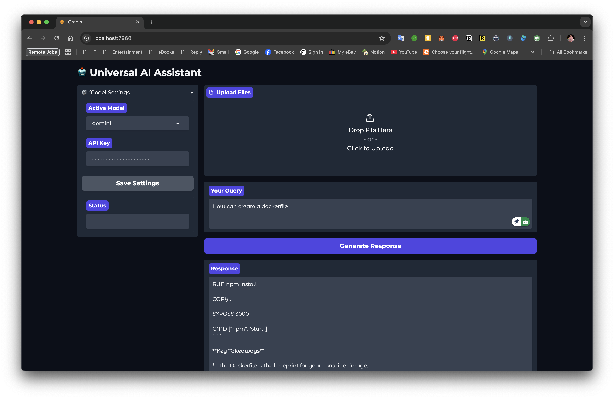

```markdown
# OpenManus AI Assistant 🤖

A multi-model AI assistant with GUI, supporting OpenAI, Gemini, Claude, DeepSeek, Groq, and Perplexity. Docker-containerized for easy deployment.





## Features ✨
- 🧠 **Multiple AI Models**: Switch between 6+ AI providers
- 📁 **File Upload Support**: Process PDFs, Word docs, images, and archives
- ⚙️ **GUI Settings**: Manage API keys and models through web interface
- 🐳 **Docker Containerization**: One-command setup and deployment
- 🔒 **Secure Configuration**: Environment-based API key management

## Prerequisites 📋
- [Docker Desktop](https://www.docker.com/products/docker-desktop)
- [Git](https://git-scm.com/)
- API keys from at least one provider:
  - [OpenAI](https://platform.openai.com/api-keys)
  - [Gemini](https://aistudio.google.com/app/apikey)
  - [Claude](https://console.anthropic.com/settings/keys)
  - [DeepSeek](https://platform.deepseek.com/api-keys)
  - [Groq](https://console.groq.com/keys)
  - [Perplexity](https://docs.perplexity.ai/docs/getting-started)

## Installation 🛠️
```bash
# 1. Clone repository
git clone https://github.com/yourusername/OpenManus.git
cd OpenManus

# 2. Create configuration file
cp .env.example .env

# 3. Edit .env with your API keys
nano .env  # or open in text editor

# 4. Make script executable
chmod +x run.sh

# 5. Start the application
./run.sh
```

## Configuration ⚙️
Edit the `.env` file:
```ini
# Active model (choose one)
ACTIVE_MODEL=gemini

# API Keys (get from provider dashboards)
OPENAI_API_KEY=sk-your-key-here
GEMINI_API_KEY=AIza-your-key-here
ANTHROPIC_API_KEY=sk-ant-your-key-here
DEEPSEEK_API_KEY=ds-your-key-here
GROQ_API_KEY=gsk-your-key-here
PERPLEXITY_API_KEY=pplx-your-key-here
```

## Usage 🚀
```bash
# Start/restart the container
./run.sh

# Access GUI at:
http://localhost:7860
```

## Usage 🚀
'''bash
# Start/restart the container
./run.sh

# Access GUI at:
http://localhost:7860
'''


### Basic Workflow
1. Select model from dropdown (⚙️ Settings)
2. Enter/paste API key for selected model
3. Click "Save Settings"
4. Type your query or upload files
5. Click "Generate Response"


## Customization 🎨
Modify `gui.py` to:
- Change theme colors
- Add new file processors
- Implement custom workflows
```python
# Example theme change
with gr.Blocks(theme=gr.themes.Default()) as app:
    # ... existing code ...
```

## Troubleshooting 🐞
| Error | Solution |
|-------|----------|
| Connection refused | Check Docker is running |
| API key errors | Verify key format and provider balance |
| Model not responding | Check `docker logs openmanus-container` |
| File processing issues | Ensure dependencies in Dockerfile |

```bash
# View container logs
docker logs openmanus-container

# Verify API keys
docker exec openmanus-container env | grep API_KEY
```

## License 📄
MIT License - See [LICENSE](LICENSE)

---

**Note**: API usage may incur costs. Monitor your provider dashboards.
```

This README includes:
1. Clear installation instructions
2. Visual placeholders (replace with actual screenshots later)
3. Configuration guidance
4. Usage examples
5. Troubleshooting section
6. Responsive formatting for GitHub

To use this:
1. Create a `.env.example` file with placeholder keys
2. Add real screenshots after `## Features`
3. Customize the "Customization" section as needed
4. Update license if needed

